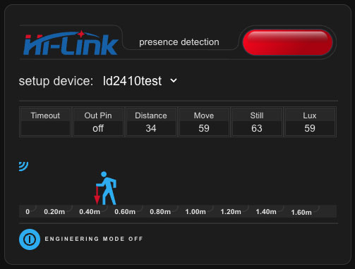

# lovelace-ld2410-control-card
[](https://github.com/hacs/integration)

[](https://www.buymeacoffee.com/madmicio)
```yaml
type: custom:ld2410-control-card
devices_name:
  - device: ld2410test
    name: soggiorno
  - device: telo-nero
    name: cucina
```




