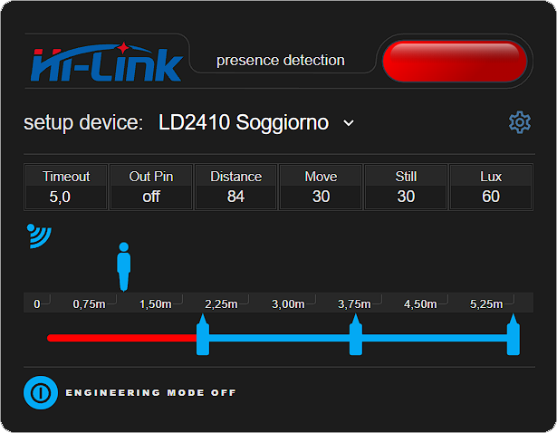
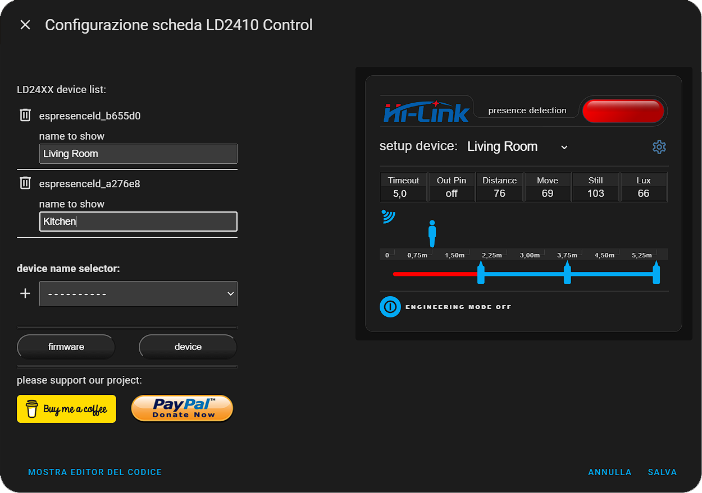
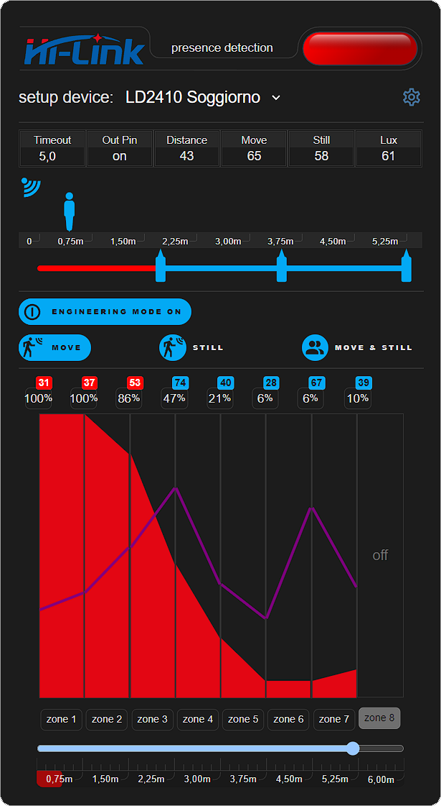
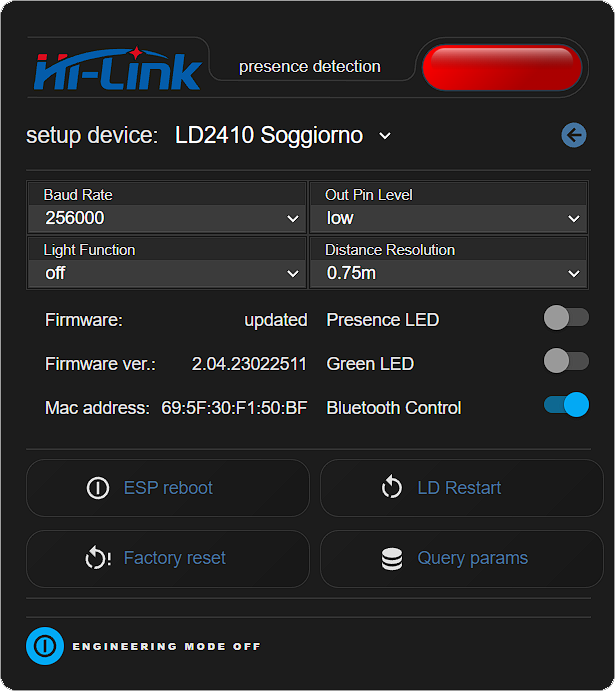

# lovelace ld2410 control-card
Custom control card for Hi-Link LD2410 Presence Detection

[](https://github.com/hacs/integration)

[](https://www.buymeacoffee.com/madmicio)




## Hacs Card Install

1. add madmicio/lovelace-ld-2410-control-card as custom reposity

2. Find and install `LD2410 Control card` plugin


### Manual install

1. Download and copy `ampli-panel-card.js`, `DS-DIGII.TTF`, `LEDCalculator.ttf`

 from (https://github.com/madmicio/lovelace-ld-2410-control-card/releases) into your custom components  directory.

2. Add a reference `lovelace-ld2410-control-card.js`
` inside your resources config:

  ```yaml
  resources:
    - url: /local/"your_directory"/lovelace-ld2410-control-card.js

      type: module
  ```


### Card Config
#### Gui Config:
by configuring the card in the visual editor, by default you will find the first LD2410 device present in your Home Hassistant configured.
The card, in fact, searches for all the LD2410s present in your system and generates a list.


#### Default Editor Config:
you will find the first configured device and below a list of available devices.
N.B.: once you have selected the device you must click on the "+" icon

the configured devices that appear in the "LD2410 device list" are automatically removed from the list of available devices

by default the device assumes the friendly name of the project.
you can edit the name in the input box of each device.


#### Manual Config:
```yaml
type: custom:ld2410-control-card
devices_name:
  - device: espresenceld_b655d0
    name: Living Room
  - device: espresenceld_a276e8
    name: Kitchen
```

### Divice Setup

in engineering mode you can configure the sensitivity of the device.
you can configure gates 2 to 8 and you can set the sensitivity of each gate.

if the red zone exceeds the purple line, then presence detection will be true



#### Addition Zone Config:


for your extra automations our project has a slider for the configuration of three additional zones. each additional zone has a binary sensor that you can use in your automations


### Options Config:
